1. Open Azure Home Page  
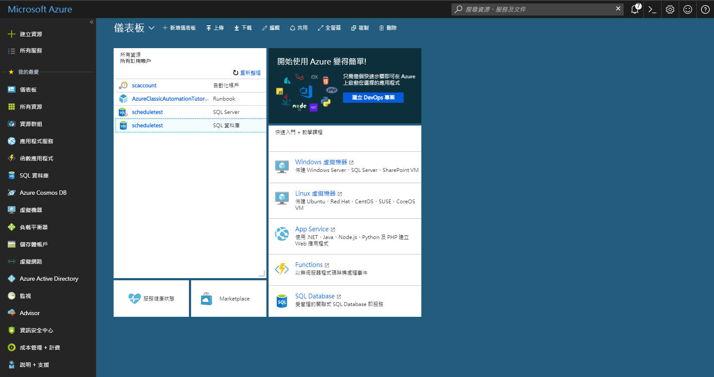
2. Search automation and click  
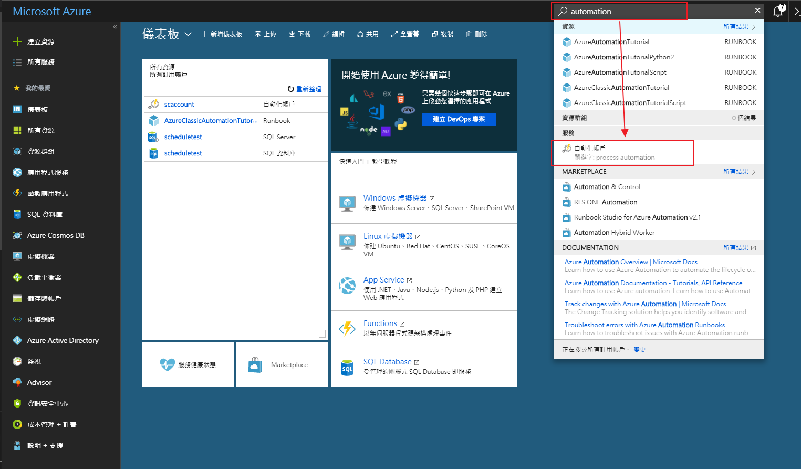  
3. Click Add  
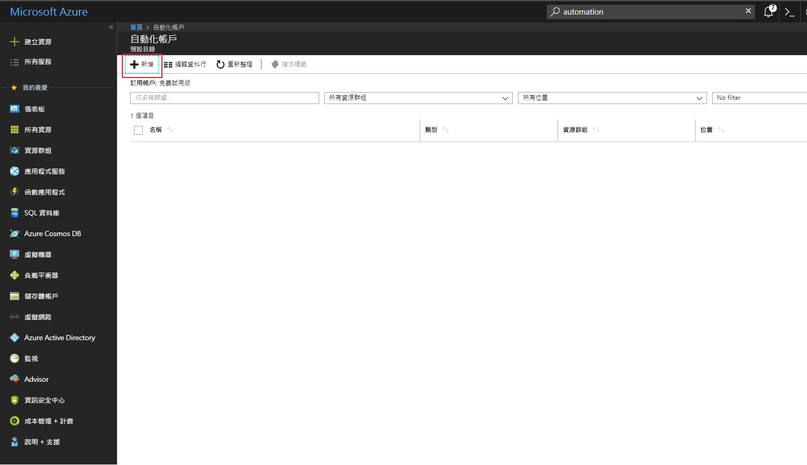  
4. Write Data and Create  
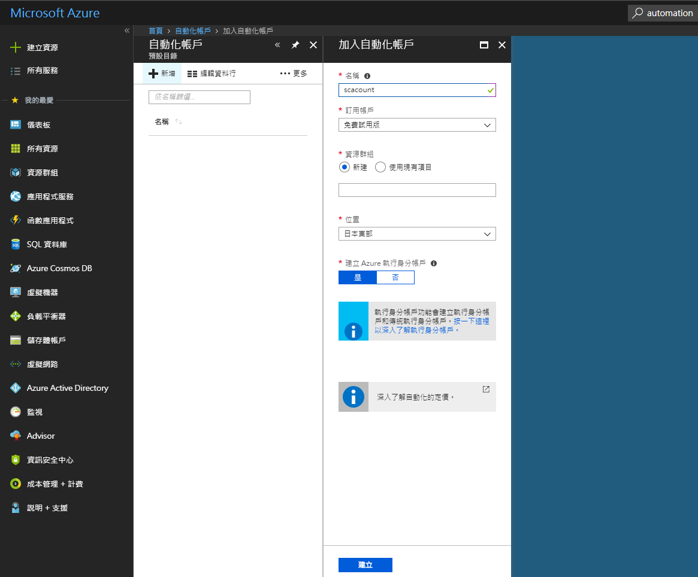  
5. Click Your Automation Account
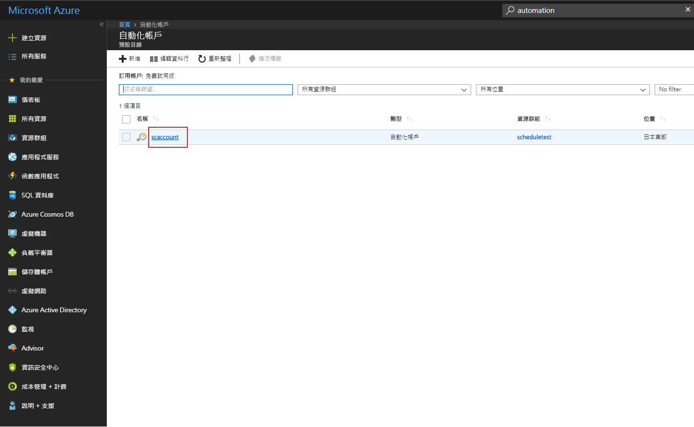  
6. Click RunBook  
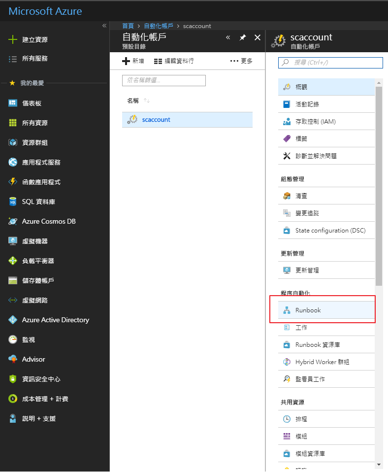  
7. Add new Runbook  
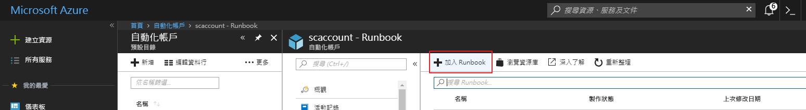  
8. Step by step to create  
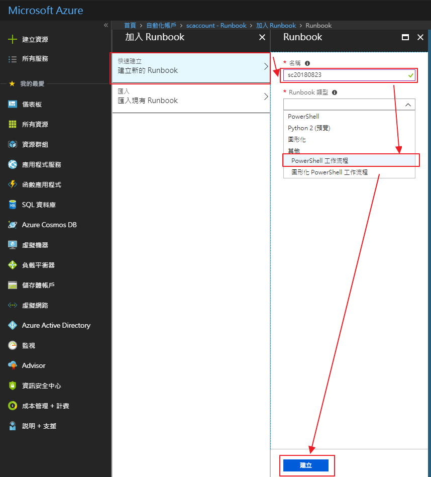  
9. Write your powershell  
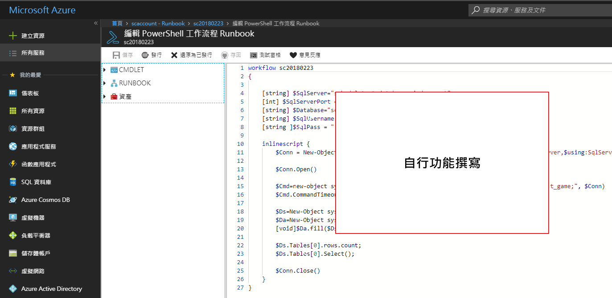  
powershell 內容  
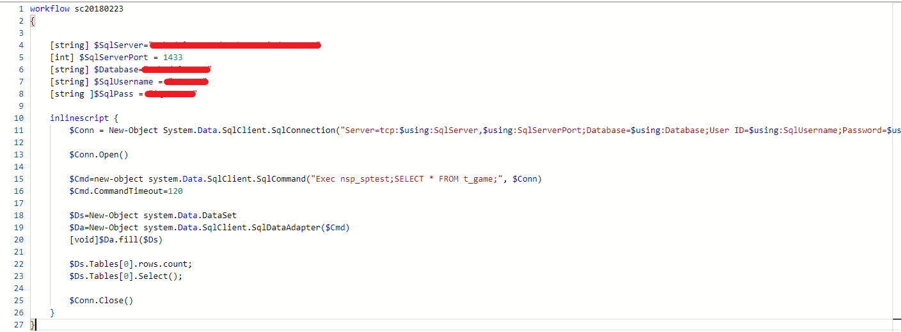  
10. Run Test  
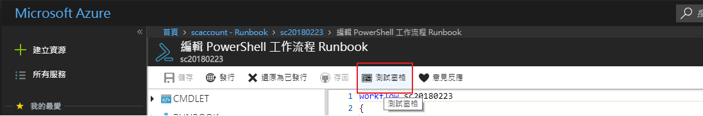  
11. Click Start  
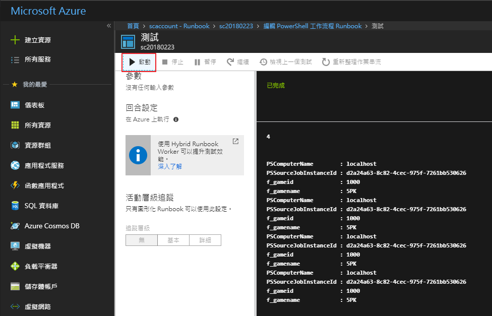  
12. Go back and deployee  
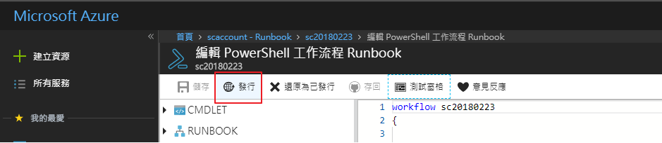  
13. Click schedule 
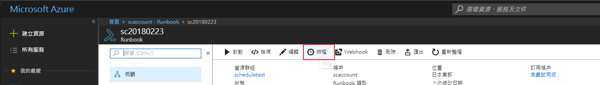   
14. Set schedule  
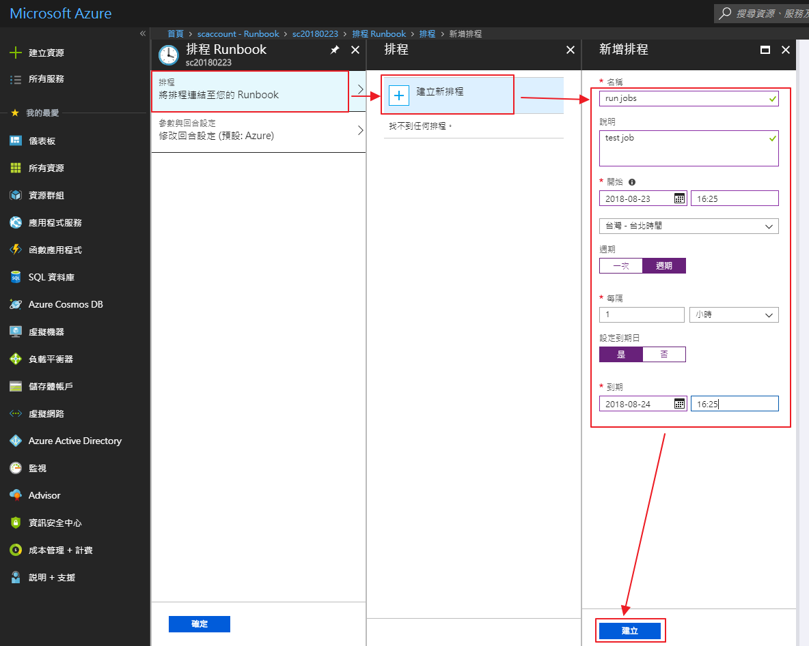  
15. Start Job  
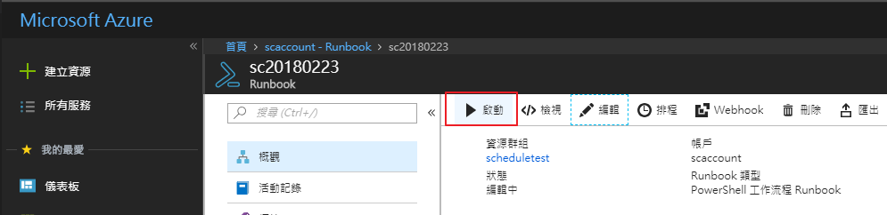

* 參考文獻  
[如何排程 Azure SSIS 整合執行階段的啟動和停止](https://docs.microsoft.com/zh-tw/azure/data-factory/how-to-schedule-azure-ssis-integration-runtime)  
[Azure 排程器](https://ithelp.ithome.com.tw/articles/10191831)   
[Automation and Scheduling in Azure SQL Database](https://www.youtube.com/watch?v=oST2u27IXac)   
[PowerShell](https://docs.microsoft.com/en-us/powershell/module/psworkflow/new-psworkflowsession?view=powershell-5.1)  

