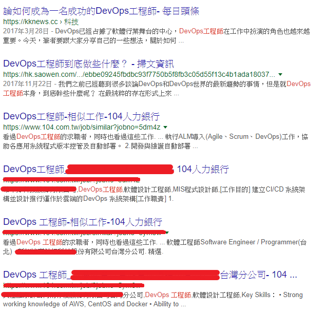

# What's DevOps?  
DevOps 從字面上就是 Development + Operations ，也就是開發與維運。可是從一些文件上看到的是「開發」「測試」「維運」三者的結合。像是下圖。  
  
在很多場合和不同的人聊起DevOps。也在不同的渠道聽到了很多人在講DevOps。然而，討論的背後，我發現每個人對DevOps 所指並不是同一件事情，也由於各執一詞導致不歡而散。  
DevOps 至今都缺乏一個清晰和統一的認識。對於一場運動來說，這是一件好事，也同樣是一件壞事。
缺乏「官方定義」好處是人人都可以定義，因此沒有一個人或者組織可以壟斷DevOps 定義權。所以每個人都自己可以參與到這一運動中去，不斷為其增加新的概念、新的實踐和新的工具。  
但是壞處也是顯而易見的。因為沒有共識，隨著不同角度出現了盲人摸象。  
  

# DevOps 的概念
目前我遇過、看過的說法大概是以下四種  
一. DevOps 是一種技術/實踐  
二. DevOps 是一個角色  
三. DevOps 是一種工作方式  
四. DevOps 是一種組織結構  

我們從上述不同的角度來看DevOps。  

## 一. 當DevOps是一種技術/實踐  

工程師對於新技術的想法通常是使用共有效率、更準確的方式去解決問題。  
而業務跟管理層對於新技術通常往往是能開發出新功能、提升KPI。  
當我們把DevOps是一種技術常常會提到的是：  
1. 快速部署  
2. Continuous delivery(CD) 持續交付  
3. 雲端/虛擬化技術  
4. 基礎設施即代碼  
5. Docker  
6. 自動化維運  

* 快速部署  
我看過、聽過有些人覺得DevOps的好處是能夠頻繁的進行部署。  
但是，在高頻率部署後面是不是應該先被檢討為什麼需要被頻繁的部署。  
是產品的不穩定還是真的有如此頻繁變動的業務需求。  
如果是1.產品不穩定…我想應該是先讓產品穩定再來做DevOps。
如果是2.頻繁變動的業務需求那我們要思考的應該是產品的功能難道是完全不可規劃的嗎？  
在一個穩定的產品，高頻率的部署不是一個好現象。  
除此之外DevOps絕對不是為了提升部署速度而犧牲產品品質跟價值而做的。  

* 持續交付  
什麼是持續交付？  
持續交付是一種軟體工繩的手法，讓軟體產品的產出過程在一個短週期內完成，以保證軟體可以穩定、持續的保持在隨時可以釋出的狀況。它的目標在於讓軟體的建置、測試與釋出變得更快以及更頻繁。這種方式可以減少軟體開發的成本與時間，減少風險。  
他是DevOps裡面的一個核心，所以常常有人會把持續交付跟DevOps畫上等號，但這是不對的。
DevOps關注的範圍更為廣泛尤其是交付過程所涉及的多個團隊之間的合作（開發、運維、QA、IT等），並且將軟體交付的過程自動化。  
在DevOps中如果沒有做到持續交付，那麼根本不能稱之為DevOp。  

* 雲端/虛擬化技術  
過去這幾年雲端服務如雨後春筍蓬勃發展，VMWare、AWS、GCP、Azure這些雲端廠商提供了更加成熟和穩定的產品。大大的節約了企業機房管理的開支。  
Ops、IT不再需要進出機房只需要通過遠程桌面的方式就可以使用各種SDK 開發工具去完成過去很多只有在機房才能做到的操作。  
雲端與虛擬化簡省了不少成本但是仍沒有解決Dev 和Ops 之間的矛盾 —— 開發團隊和維護團隊仍然各自為政。  

* 基礎設施即代碼  
基礎設施即代碼這個我能理解他的意思，但是我找不到比較合適的文字解釋。  
隨著網路設備跟網路技術持續進步與更新。更加複雜的應用程式部署方式。如何有效的管理這些設備與有效的管理介面變成Ops的困擾。  
DevOps在一定程度上解決了不同環境（開發，測試，維運）之間的不一致問題，也讓開發人員能夠學習到Ops領域的知識並用軟體開發的思維解決運維領域的問題。  

* Docker  
Docker 是含著DevOps的金鑰匙出生的，它誕生的第一天就帶著DevOps的基因：更簡單的解決了部署和虛擬化在實踐中的問題，進一步提升了自動化能力以提升效率，並且對開發人員和維運人員都十分方便。  
Docker 一定程度上簡化了部署流程和狀態管理問題。通過鏡像和運行時容器封裝了應用程式運行時的複雜度。並通過容器的編排實現輕量級的分佈式架構，也達到解省成本的目的。

* 自動化維運  
看了上面的說明，很多對DevOps望文生義 或有些技術了解的運維工程師認為提高了自動化運維的水平，就是DevOps。雖然DevOps裡的一個重要特徵是「自動化」，但擁有自動化維運，並不代表你就正在實踐DevOps很可能你僅僅提升了維運部門的效率，但並沒有從全局的角度提升開發和運維之間的效率和端到端價值的流動。因此，僅僅有自動化運維，還不足以稱之為DevOps。

## 二. DevOps 是一個角色  
  
當DevOps熱潮開始發酵，大家都會傾向於去找叫做「DevOps」的人，希望通過招募和培訓來提升自己的DevOps能力。於是設置了一些稱之為「DevOps 工程師」的職位和角色。  
但是我發現其實每間公司對於DevOps工程師的要求不太一樣。  
  
  
大致上，可以在分類為以下四種不同的DevOps工程師：  
1. 身為Dev的Ops（會開發技能的運維工程師） 
2. 身為Ops的Dev（會運維技能的開發工程師） 
3. DevOps工具開發工程師  
4. 全能的工程師  

* 身為Dev 的Ops  
有很多人也會認為，只要讓開發工程師掌握維運技能，維運工程師掌握開發技能，就做到了DevOps。這讓很多維運工程師的反感。我認識一些維運工程師，當初他們就是不喜歡也不想寫code或是不會寫code，才選擇了維運工程師。  
這種想法的其中一個動機是在於架構的逐漸穩定帶來的維運工作減少，特別是使用了雲端技術和虛擬化技術的公司。這會讓管理層有一種錯覺，認為維運團隊的空閒狀態，一定程度上是浪費。因此，為了達到人盡其用，讓維運工程師進入開發團隊去進行開發。並用DevOps作為對這種措施這一合理化的幌子。  
這種天真的想法忽視了開發和維運的專業性和差異性。  

* 身為Ops 的Dev  
同樣的誤解也會發生在開發工程師身上。對於開發工程師來說，其實難度並沒有增加。無非是把Ops 的工作當做需要通過別的工具完成的開發需求而已，甚至很多開發工程師自己也這麼認為。  
產品開發和產品維護是相互關聯但是各自獨立的專業領域。DevOps 並不是要消除任何一方，而是要通過更加深入的合作成為彼此工作的潤滑劑而非絆腳石。  
對於開發工程師來說，掌握更多的技能絕對是一件好事。但也不要低估維運的專業性和經驗性。畢竟人力有窮盡。  

* DevOps工具開發工程師  
透過Dev的方式完成Ops 的工作，就是DevOps，成為了很多Ops 對DevOps的認識。指的是通過SDK，相關工具和配置文件，利用現有的資源，為產品編寫DevOps工具。而他們往往有一個新的稱謂：Infrastructure Developer。

* 全能工程師  
不可否認有些工程師是既懂開發也懂維運的複合型人才。但這樣的人才的成本也十分高昂：一方面是尋找這樣的人所花費的時間。另一方面是僱用這樣的人所花費的成本。此外，對於某些企業來說還有培養這樣人才的成本不斐。而且DevOps是一個Teams的事情不是一個人的事情。  

## 三. DevOps 是一種工作方式  
這是目前幾個說法中我覺得最貼近的定義，但是基於他是一種工作方式也有以下三種不同的解釋： 
1. 用Dev 的方法做Ops的事  
2. 換了名字的Ops團隊  
3. 一個有Ops的Dev團隊  

* 用Dev 的方法做Ops的事  
這跟剛剛上方說的「身為Dev的Ops」非常類似，嚴格說來就是做了自動化建置、自動化部屬的時候，就覺得我已經做到了DevOps。  

* 換了名字的Ops團隊  
這其實是很多公司的做法，認為DevOps所做的事情只是技術的更新。Ops團隊開始使用一些新的工具，清償了部分之前遺留的技術債，但對整體團隊沒有幫助。  

* 一個有Ops的Dev團隊  
最天真的想法莫不如把兩種工程師放在一個團隊裡，在同一個負責人的範圍內消化Dev和Ops的問題。這樣，Dev和Ops就能統一目標，平衡矛盾和衝突，共同解決問題。但實際上這會讓部門內矛盾衝突化，部門內的KPI也無法做統一考核。  
舉個例子來說，過去我有些工作團隊習慣性把團隊分組別，部分人員負責功能開發，另一部分負責線上維護。常常就是會發生負責維護的同仁會抱怨開發同仁程式品質不佳，開發人員則是抱怨維護同仁上班時間不做事情又報加班，負責維護的同仁則會表示他也不願意，只能在客戶下班時間進行作業。  
即使是類似的工程師都會發生這些問題，何況是兩種不同性質的工程師。  

## 四.DevOps 是一種組織結構  
在2009 Velocity大會上，來自Flicker 的著名演講”10+ Deploys Per Day: Dev and Ops Cooperation“ 明確的指出工具和文化是他們成功的原因。這也第一屆DevOpsDays 也將工具和文化這兩個話題進一步細化。在會後Patrick Debois 把DevOps 定義為“管理改進”和技術提升“。  
有些人覺得DevOps是一種空談，因為在這一切成為習慣之前看不出實質效果。大概就是一種不過就是換了個工具換了個新的技術。  
這些公司其實不存在產生DevOps 的基因（否則早就有DevOps 了）。這些制度很難從內部產生，必要的話，請引入外部資源，例如DevOps 顧問或者DevOps教練。但是更常發現的是，沒有了顧問，什麼都沒有了，剩下的是推諉跟卸責。  

# 到底什麼是DevOps  
感覺上好像講完了，又好像什麼都沒有講。  
再繼續往下說之前有幾個延伸主題: Agile、Scrum、CI、CD、TDD、QA  
這次我們倒著講回來，先來聊聊QA  

# 延伸主題 一 QA
大家可能會有點好奇為什麼DevOps要講QA，明明是Dev 跟Ops。複習一下最開始的圖。  
  
我們仔細想想從開發到維運，中間是不是少了什麼？沒錯就是QA。  

QA 的工作內容落差很大，要求的條件落差也很大。有的公司QA是獨立部門，有的是掛在Dev底下，有的則是掛在PM底下。一樣我們一個一個來看。  

## 獨立的QA部門  
在組織架構上他跟Dev還有Ops是平行的部門。有些大規模公司除了公司自己產品的 QC 負責 IQC/OQC，另外還會有自己的實驗室、認證中心、制定認證的團隊，甚至是專門執行認證與稽核的業務，更大的就是獨立成一種獲利模式的公司，專門蓋章用，具備權威性，像是 ISO 9XXX  
這種 QA 單位，技術、與領域知識並重，是完整的營運單位。  
好處很明顯，非常的專業，甚至可以獲利。
缺點也很簡單，容易形成穀倉效應。  

## Dev底下的QA  
這個通常是以技術為導向。
這類的 QA 要懂技術，會寫 Code，懂得自動化工具。依照不同產品性質，需要條件如下：  
1. 產品本身就是技術性產品，例如網路設備、專業音樂編輯軟體，通常這類的QA需要具備一定程度的領域知識與專業能力，知道很多實際的使用情境。  
2. 產品本身是消費性的，例如電商網站、人資系統，大部分QA不需要具備專業知識，就可以入門。  

在這樣單位底下，通常大主管(Dev主管)會用技術導向來看QA這件事情，而看不到程序問題，習慣性的會問用什麼 automation tools、什麼程式語言，而不是問 QA 在整個開發流程扮演怎樣的角色、怎麼有效回報問題、怎麼溝通、組織與分析問題、測試方法、測試管理 (Test Management) … 。我說通常。  

好處是說今天你想送測什麼基本上不需要跟外單位搶人搶時間。  
缺點來說有幾點：  
1. 從組織職權來看，很容易變成相對弱勢，換言之，無法發揮把關的功能，很容易變成附屬單位。  
2. 因為不是獨立運作，系統配置，像是 Resource Provisioning、Deploy 都仰賴Dev，QA無法獨立運作。  
3. 以為品質應該是 立竿見影………恩，我覺得跳樓才是立竿見影，18年後又是條好漢。  

像這些問題其實導入了CI/CD可以有效緩解部分問題。  
但是要讓QA可以獨立運作，要學習瞭解系統架構、環境建置、還有配置管理也要學習。  
除此之外好記性不如爛筆頭，講過的東西會忘，寫下來的不會，除此之外溝通要時間，描述問題要時間Dev不一定有時間。所以與其花很多時間溝通，不如花時間訓練QA寫文件。
另外還有Issue Tracking…等等還有很多東西要做。  

## PM底下的QA  
掛在PM底下的QA，其實應該叫QC，很多時候是PM兼著做，因為PM要測了才知道產品長怎樣。工作以產品內容的商業邏輯確認為主、專注的不是技術，需要很清楚產品的內容、需求規格、流程等。  
缺點：  
1. 容易以成本考量，QA 專業會直接被忽略。  
2. 外行領導內行，忽略職能的專業。  
這部分就會建議找懂 Agile/Scrum 的人加入，讓PM專職做PM。  

# 延伸主題 一 TDD  
關於TDD，很多人對他的誤解沒有比對DevOps來的少。我聽過的誤解有：  
1. TDD是一種測試方法。  
2. TDD很神，有了TDD我們就不用QA了。  
3. TDD治百病。

* TDD是一種測試方法  
  
關於這點，首先我們先幫他正名一下，TDD他不是一種「測試」方法，他是一種「開發」方法。  
藉由先定義規格，再撰寫程式的方式來開發。等等你會想問這不是瀑布式開發嗎？  
別急，慢慢來。TDD的中文是「測試驅動開發」。你以為它是測試，但其實在它的本質上，同時兼具了「Specification」與「Test」兩種維度的身份。  

和傳統瀑布式開發的方式不同之處在於，TDD的規格本身就是可執行文件，將規格以可執行的「測試案例」來表達。  
這樣的好處是，因為驗收標準（規格）已經先以可自動執行的測試案例形式寫好，一旦production code完成之後，測試案例（也就是驗收規格）已經存在，可以避免先寫production code，然後以沒時間為藉口，不寫test code的情況。  
另外，因為規格文件可以被執行，所以可以自動驗證規格與實作在多次修改之後是否依舊保持一致。也因為如此，所以和傳統開方法方式相比，會有比較低的bug比率。  
TDD只是恰巧可以扮演「自動測試」的工作，例如驗證程式運作是否符合預期，驗證有沒有改 A 壞 B 的情況，再透過測試覆蓋的路徑來觀察是否多寫了不必要的程式碼，或是遺漏了描述需求的測試案例。  

* TDD很神，有了TDD我們就不用QA了  

關於這個，我們剛剛介紹過QA的工作了。  
1.一個厲害的QA除了驗證程式的品質外追蹤Defect/Issue處理進度，收集、協調、討論溝通問題，同時扮演第三方的角色來客觀監督審查專案的品質，甚至還可以幫忙檢查開發人員是否有落實TDD三定律。（TDD三定律：(1)沒有測試之前不要寫任何功能代碼；(2)只編寫恰好能夠體現一個失敗情況的測試代碼；(3)只編寫恰好能通過測試的功能代碼）  

2.對於測試的設計（Test Design），如Test Cases情境的撰寫，測試環境的準備與使用，測試人員還是比開發人員會多一些經驗與關注。簡單講一點，像"等價分割法"對於Test Cases的設計有效度是有幫助的，但這是測試方法論，不是開發方法論。太過於要求開發人員執行TDD的時候要懂得Test Cases Design，反而會分散了開發人員的專注力。  

3.TDD是功能測試，非功能測試的部分（如安全性測試、效能測試等等）是TDD無法取代的，還是要有人進行這些測試。  

* TDD治百病  

這個我們直接實際上來演示一下，找一個菜鳥工程師先寫一個失敗的測試案例，然後以最簡單的方式實作production code讓測試案例通過，待功能完成之後，重構程式（red、green、refactor）。  
但流程是空的，難的部分在於如何用測試案例定義規格、如何讓眾多的可執行規格可以持續用來驗證系統正確性，以及實作完成之後的重構工作。TDD沒辦法讓菜鳥工程師一朝得道頓悟變成絕頂高手。  

TDD 可以「一次滿足你哪些需求跟解決哪些問題」，你不一定要使用 TDD，只是這是目前能只花一份工，卻可以同時滿足這些要求的最有效益的開發方式。如果你有更好的方式解決抱著 TDD 不放。  