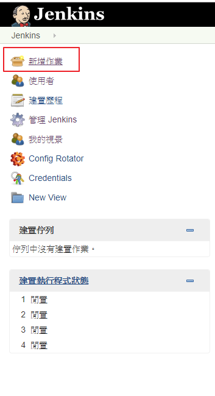
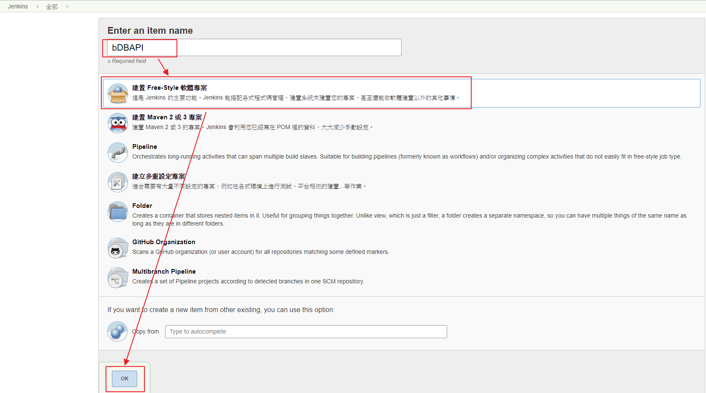
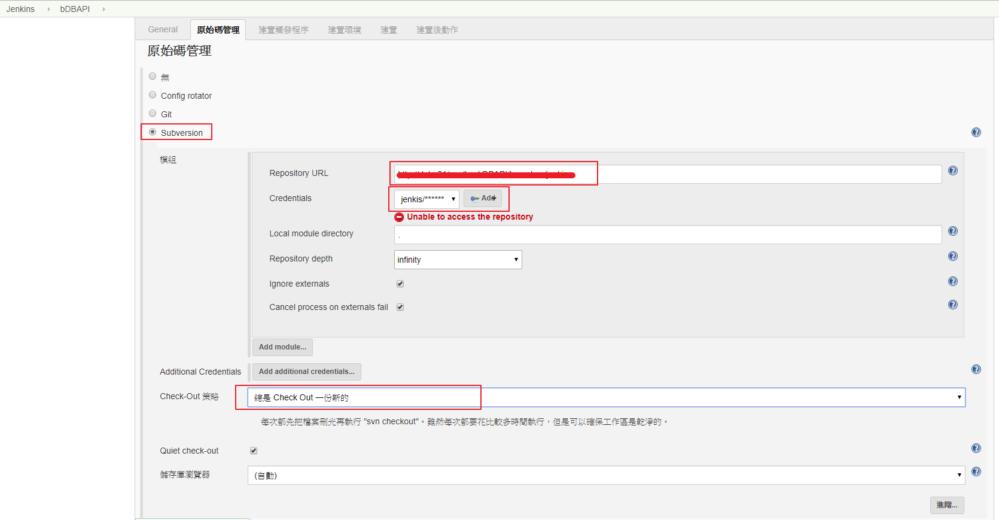
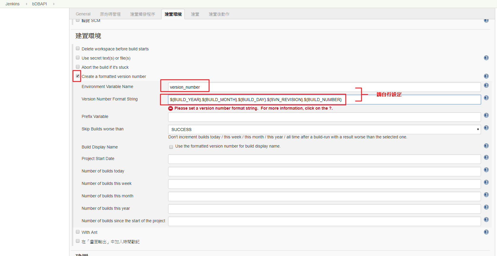
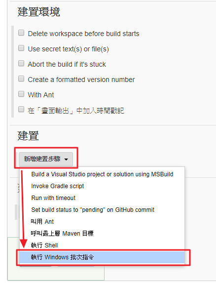
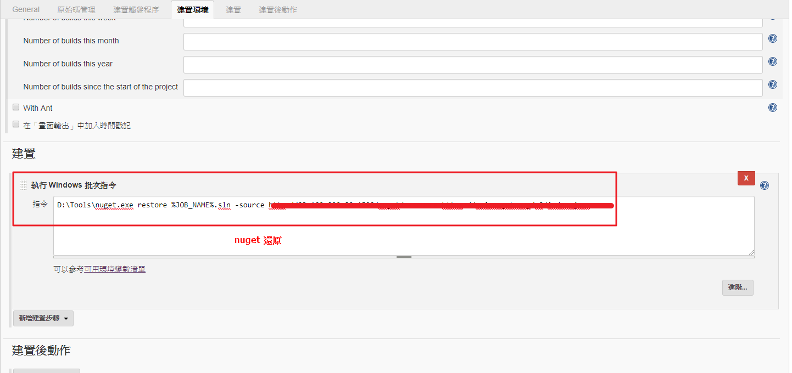
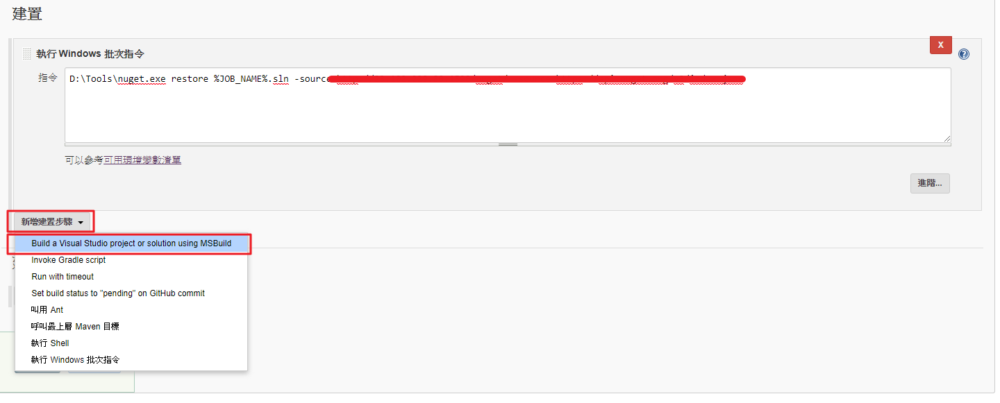
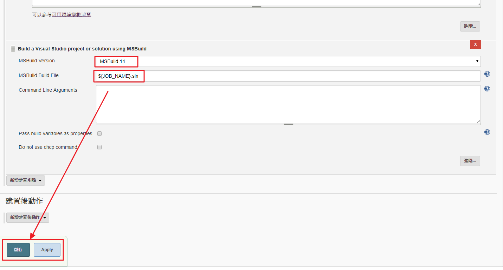

# 前言  
為了單元測試以及自動化部屬前置作業  
使用前該上nuget的請先上nuget  

1. Create new JOB  
  

2. Create item name and select free-style project  
  

3. Select your source code management and seting  
  

4. Setting build environment  
  

5. Create build step windows batch command  
  

6. Setting nuget restore  
  

7. Create build step Build a VS project or solution using MSBuild  
  

8. Setting MSBuild  
  

* 參考  
[[Jenkins] 使用發行設定檔來部屬Asp.Net MVC網站](https://dotblogs.com.tw/kirkchen/2013/08/12/setting-jenkins-to-use-visual-studio-pubxml-with-website-deployment)  
[How to Use Jenkins to Deploy C# Web Applications to IIS](http://matthewyukiuchino.com/how-to-use-jenkins-to-deploy-c-web-applications-to-iis/)  
[Jenkins持續整合設定 for .Net](https://dotblogs.com.tw/jamis/2016/04/05/115537)  
[Docker系列之Jenkins自动化部署](http://www.open-open.com/lib/view/open1499256546666.html)  
[如何使用 Jenkins 2 建置 .NET 專案](https://blog.yowko.com/2017/02/jenkins-2-build-dotnet-project.html)  
[Jenkins初步嚐鮮(.Net)](https://dotblogs.com.tw/alanlun/2017/06/01/152143)  