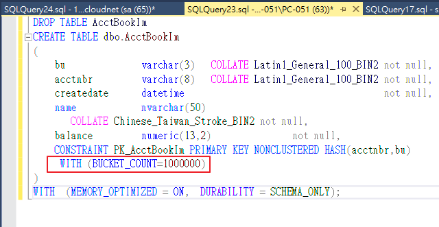

* 前言  
SQL Server 的效能調校是一門很大的學問，會影響的範圍很廣。最常見的T-SQL寫的好壞，這部分就影響很大。還有一些比較常見的像是磁碟效能、記憶體大小...也都會影響。  

先簡單介紹一下SQL Server的一些特性  
SQL Server 使用三種不同的檔案在儲存你的資料:  
1. MDF(主要資料檔) : 包括Table、索引還有資料
2. NDF(次要資料檔) : 跟MDF相同。只是放是放在不同的檔案群組  
3. LDF(交易資料檔) : 存放所有資料檔的歷史變更紀錄  

SQL Server 寫入資料時 (INSERT, UPDATE, DELETE)，至少會先確保資料有寫入交易記錄檔才會進行下一步動作，而寫入交易記錄檔這一段幾乎是無法最佳化的，考驗的就是你的磁碟 IO 的效能，由於交易記錄檔的寫入幾乎是「循序的」，所以磁碟 IO 的效能數據 (IOps) 要看的是 循序寫入(Sequential WRITE) 的速度，所以一般都建議使用獨立的硬碟來放置交易記錄檔，以確保資料寫入的效能。  

SQL Server 讀取資料時 (SELECT)，就完全依賴 資料檔 (MDF, NDF) 的讀取速度，由於資料寫入資料檔時通常不是循序的，所以資料通常非常亂且透過內部索引指標指來指去的，所以 SQL Server 在讀取資料時幾乎都是「隨機存取」，所以磁碟 IO 的效能數據 (IOps) 要看的是 隨機讀取 (Random READ) 的速度，數據越高就代表讀取效能就越好。  

* Using Stored Procedure it's Better... Why?  

 Stored Procedure 中文是預存程序，從中文名字上我們就可以知道為什麼比較好，預先儲存，所以我們可以避免CPU重複編譯的資源消耗。  
 Stored Procedure 是在建立的時候進行剖析和最佳化，所以只要執行一次 Stored Procedure 後，就可以使用 Procedure <h2>存在記憶體中的版本</h2>  

* In-Memory OLTP  
> 不是所有OLTP 都可以獲得改善  
> 降低CPU資源、更快的交易處理、減少TempDB資源爭奪、更高傳輸量  
> 耗用的記憶體必須等到離開變數範圍(go)才自動釋放  
> GC無法介入回收  
> 不會造成SP重新編譯、不受rollback影響  

* In Memory Table 記憶體最佳化資料表
跟傳統式資料表無太大差異，但是需要在一開始的創建時就做好相關設定。  
1. 建立最佳化的FILEGROUP
2. 建立記憶體最佳化資料表(僅支援SQL Command進行建立，無GUI介面可使用)  
差別在於 WITH (BUCKET_COUNT=1024)跟   
WITH  (MEMORY_OPTIMIZED = ON,  DURABILITY = SCHEMA_ONLY);  
DURABILITY(實體化資料) 有SCHEMA_ONLY、SCHEMA_AND_DATA 兩種模式 

特點 
1. 無法壓縮  
2. 有data or index只有rows
3. 無法跨資料庫交易和查詢、可以跟disk  table進行join
4. BUCKET_COUNT 大小須妥善評估；太大浪費記憶體，太小影響效能(尤其是批次新增)。建議大小:索引鍵的兩倍。  
5. SQL 2014 修改Bucket 只能DROP Table and CREATE。SQL 2016可以ALERT rebuild index  

* 測試範例  
1. Create Database set file path  
  
2. Set Filegroup  
  
3. Create Disk Base Table & In-Memory Tabl(schema only)  
  
4. Test Insert 1000000 data to Table  
  
5. Test Update 1000000 data  
  
6. Fix In-Memory Table BUCKET_COUNT 1024 -> 10000000  
  
7. Retry Update 1000000 data  
  