# SQL Server  

## SQL Server 之路 ㄧ 什麼是索引  

有接觸過SQL SERVER的應該都會知道，SQL Server Index 分為叢集索引(Clustered-Index)跟非叢集索引(NonClustered-Index)  
但是什麼是Clustered-Index? 什麼是NonClustered-Index? Index到底是什麼?  

當資料有異動的時候，系統會先依索引的建值進行資料的排序，排序後再放入硬碟。如果資料表沒有建立Clustered-Index，這時候資料表裡的資料就是未排序的(heap)。  
索引簡單來說就是針對資料庫的內容進行排序的方式。利用索引可以加快查詢。  

舉例來說像是門牌XX路一段1號到20號在第一排依序排列，OO路一段1號到20號在第二排依序排列，◇◇路一段1號到20號在第三排依序排列。  

今天要去XX路5號的王先生，我們只要到第一排很快就可以找到，以資料庫來說當你有建立索引(門牌)，SQL Server 將基於該索引鍵值和結構來定位 (透過指標) 資料位置，只搜尋必要的資料頁(只要找XX路)，這個在資料庫中稱為索引搜尋 (Index Seek)。  
可是如果沒有了門牌(索引)這個，房子都是任意穿插。我們就要先把全部人住哪邊都列出來，資料庫中稱為資料表掃描(Full Table Scan)。不是找不到，只是比較久。  

## 叢集索引(Clustered-Index)  

Table資料本身就是叢集索引的一部分(含所有欄位)，Table本身就是叢集索引的分葉節點(leaf level)  
Clusterd-Index 通常一個資料表只能建立一個，為什麼呢? 這是因為因為資料存放順序只能遵守一種準則(大到小或小到大)。  
上面提到建立Clusterd-Index後，資料即享有排序同時Table資料本身就是叢集索引的一部分(放入硬碟是依照索引排序)  
所以挑選Clusterd-Index欄位應該符合常使用來排序的欄位(order by、group by)或唯一，也就是該欄位資料你不會輕易更改都適合建立Clusterd-Index  
除此之外獨特性過高的欄位也不適合，因為實體資料是經過排序存入到硬碟中，若欄位中每筆記錄都沒甚麼順序性，則無法有效利用到此排序索引，例如，一個門市的銷售檔內，只以「稅別」當索引鍵，當查詢時若用到的是日期、商品或是公司來進行查詢時，都不會使用到Clustered-Index排序的功能，除此外也可能因一千萬筆的銷售資料中，只有一筆是免稅，其他都是含稅，導致無法有效的利用到排序。  
另外上面有提到，系統會依照Clusterd-Index進行排序，過多、過大或是可為NULL欄位也是不適合，這會造成系統在排序時的負擔。  

## 實測 叢集索引差異  

一. 查詢效能差異

1. Create Table  
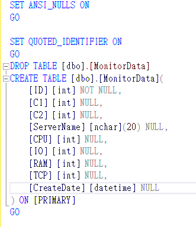  
2. Insert Data  
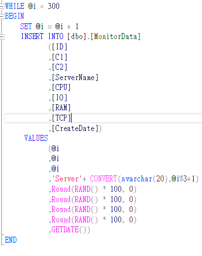  
3. Open STATISTICS TIME and STATISTICS TIME  
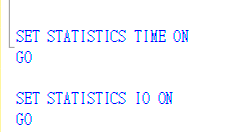  
4. SELECT Data  
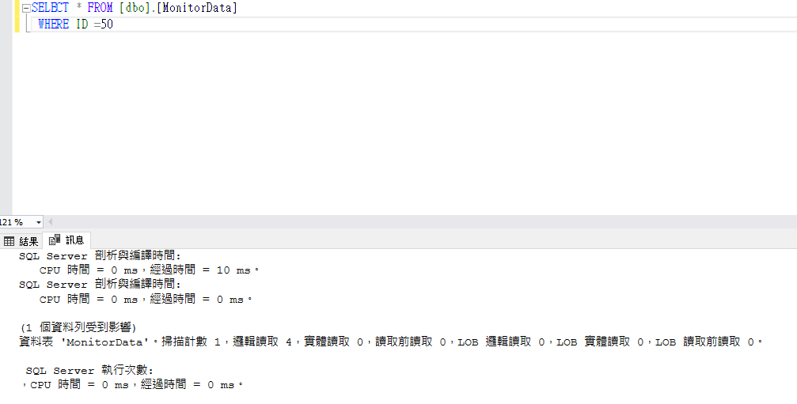  
5. ADD INDEX  
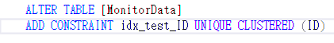  
6. SELECT Data again  
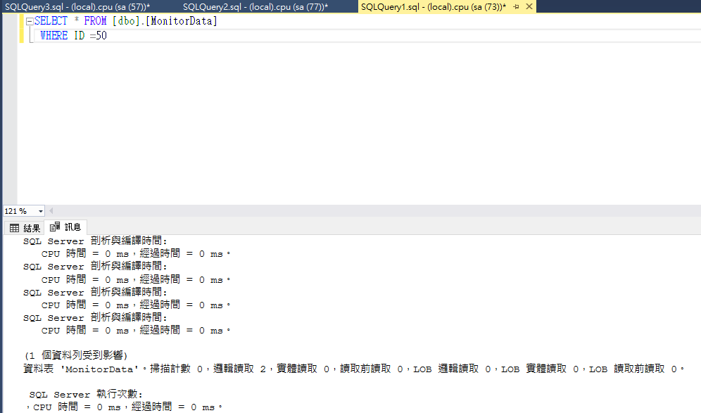  

二. 資料排序差異  

1. Create Table and Set Clustered-Index on ID1  
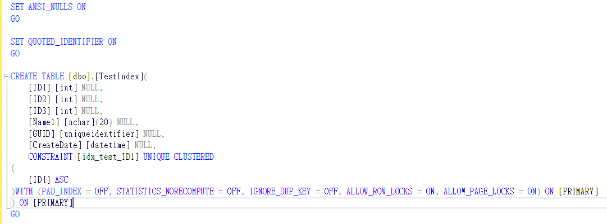  
2. INSERT Data And SELECT  
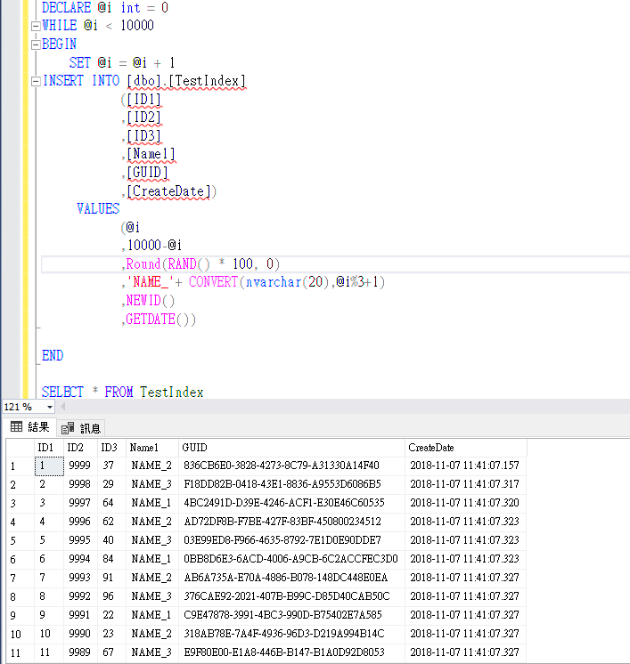  
3. Create Table and Set Clustered-Index on ID2  
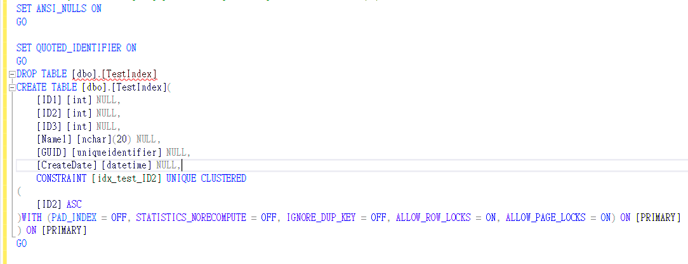  
4. INSERT Data And SELECT  
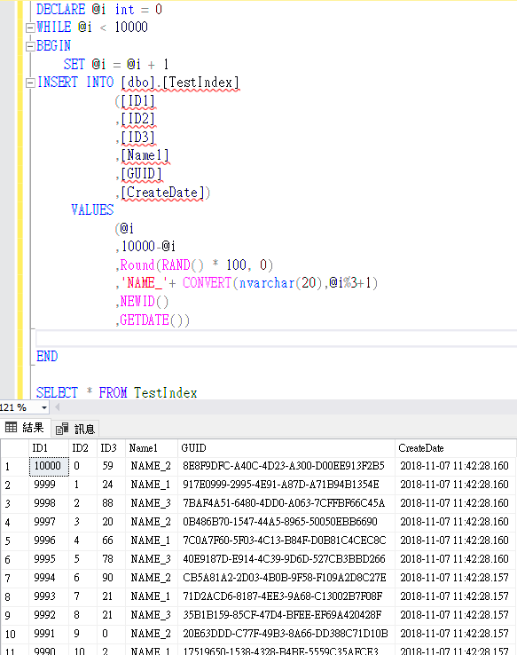  

## 關於叢集索引選擇

從上述例子，我們在選擇挑選叢集索引欄位應該符合常使用來排序的欄位(order by、group by)或唯一，以及不可NULL，也就是該欄位資料你不會輕易更改都適合建立叢集索引。  
另外常有人把PK跟叢集索引搞混，會搞混的原因是我們在建立PK的時候系統會同時自動建立一個相對應叢集索引，因為主索引鍵是一種「條件約束」，這個條件約束將會限制重複的索引鍵值，並不是因為叢集索引的原故。  
所以我們上面在說Clusterd-Index 通常一個資料表只能建立一個，但是也有例外。你建立了一個叢集索引以及一個PK，這時候你就會擁有兩個叢集索引。那你也會好奇詢問，寫入資料庫的時候是依照誰做排序。實測後是依照叢集索引排序而非PK。  

## 非叢集索引(NonClustered-Index)  

非叢集索引與叢集索引有下列差異：  

1. Table的資料列並未依據非叢集索引鍵的順序，進行排序與儲存。  
2. 非叢集索引的分葉層是由索引頁 (而不是資料頁) 所組成。  
3. 如果Table有建立叢集索引則非叢集索引也包含叢集索引的鍵值。  

非叢集索引不排序或存放任何資料，索引頁 (index page) 上所有分葉節點只存放指標，如果資料表已存在叢集索引，那麼該指標將會指向叢集索引，如不存在將指向資料真實存放位置，所以建立叢集和非叢集索引順序相當重要。

當一個資料表沒有叢集索引時，先建立非叢集索引的分葉層頁面指標將指向真實資料位置，如叢集索引已經存在時將指向叢集索引，先建立非叢集索引可以避免當你重建叢集索引時，連帶影響非叢集索引一起重建 (須注意索引兩次重建問題)，這不僅拉長重建索引時間，也增加交易紀錄檔大小且浪費硬碟空間。

## 中場說明 B-TREE  

### B-TREE  

SQL SERVER 所有索引基本上都是使用B-TREE結構，除了 xml 索引、全文檢索索引 (full-text)、資料行存放區索引 (columnstore index) 和記憶體最佳化索引 (Memory-optimized indexes) 不用B-tree。 xml 索引是存放在 SQL Server 底層資料表，全文檢索索引是利用自己引擎來處理查詢和管理全文檢索目錄 (full-text catalogs)，資料行存放區索引則是使用 in-memory 技術，記憶體最佳化索引則是使用 BW-tree 結構。  

* B-tree架構  
  
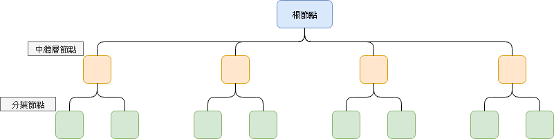  

一個 B-tree結 構一定是平衡的，這代表每一層左右頁面數量一定相等，最末的分葉頁面包含了排序後的索引資料，每頁索引資料列數量視索引所含資料行的儲存空間而定。

根節點及中繼層節點包含其下層節點的第一項資料，即表示指向下層資料儲存位置的指標 ，SQL Server 執行查詢時會先掃描每一個根節點所在頁面，搜尋是否含有查詢的值，找到後再以指標指向下一層繼續搜尋，如此不斷反覆處理，直到在最末層的分葉節點中找到資料為止。  

* B-tree 存放方式  

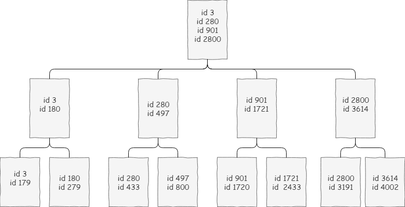  

假設今天要尋找id 1521這筆資料，SQL SERVER會從根目錄開始搜尋，判斷1521 介於901與2800之間，所以會從901這邊開始搜尋並計算1521的可能位置，指向中繼層(901-1721)再指向分葉層(901-1720)，此時已到最末層，如果id 1521不存在則會回傳找不到。B-tree 的平衡效果，使得 SQL Server 每次在索引內搜尋資料動作時都只會在相同數量的各層索引頁內處理，以利精準地找到所需資料。  

## 叢集索引 VS 非叢集索引

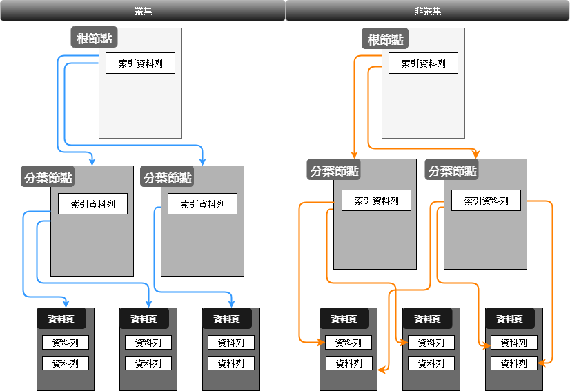  

## 填滿因子(Fill Factor)

透過設定填滿因子可以微調索引效能和儲存空間，該因子會決定分葉層頁面填滿資料的空間百分比 (保留每個頁面可用空間)，以利未來資料成長使用，主要目的是要減少頁面分割發生頻率，如設定 90 (預設 0) 表示只預留 10% 空間比例，實務上我建議該值依資料表讀寫特性設定比較有效益，因為設定過低將增加頁面分割頻率，也造成索引碎片過多增加 I/O，進而影響查詢效能且容易發生長時間 Lock 資源情形，但設定過高也會影響資料異動效能，所以建議必須依資料表讀寫特性設定取得一個平衡值，下面是填滿因子建議值：  

1. 唯讀或靜態資料表: 設定 100%  
2. 異動頻率很低的資料表: 設定 95%  
3. 異動頻率一般的資料表: 設定 85%~90%
4. 異動頻率很高的資料表: 設定 50%-80%  

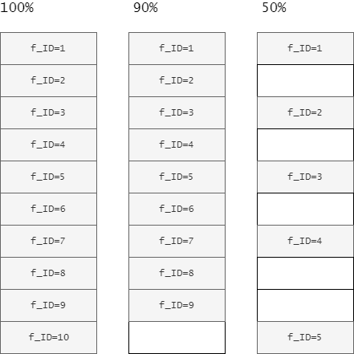  

## 索引破碎  

大家都知道，在硬碟上執行刪除、移動檔案..等操作，會為硬碟帶來空間碎片，因為檔案容易破碎，造成檔案寫入空間沒有連續，所以時間一久，就會造成檔案破碎程度越來越大，進而影響資料存取效能(硬碟搜尋時間拉長)。  

同樣的為什麼會發生索引破碎。原因就是我們會不斷的新增刪除資料，相對的索引指向的位置也會做異動。Fill Factor設定100%(不巧，叢集索引又沒設好)，結果在中間又Insert了幾筆資料。就會發現資料不會出現在同一個區塊。導致查詢的過程增加掃描次數，讓查詢變慢。  
所以定期的索引重建是很重要的。
