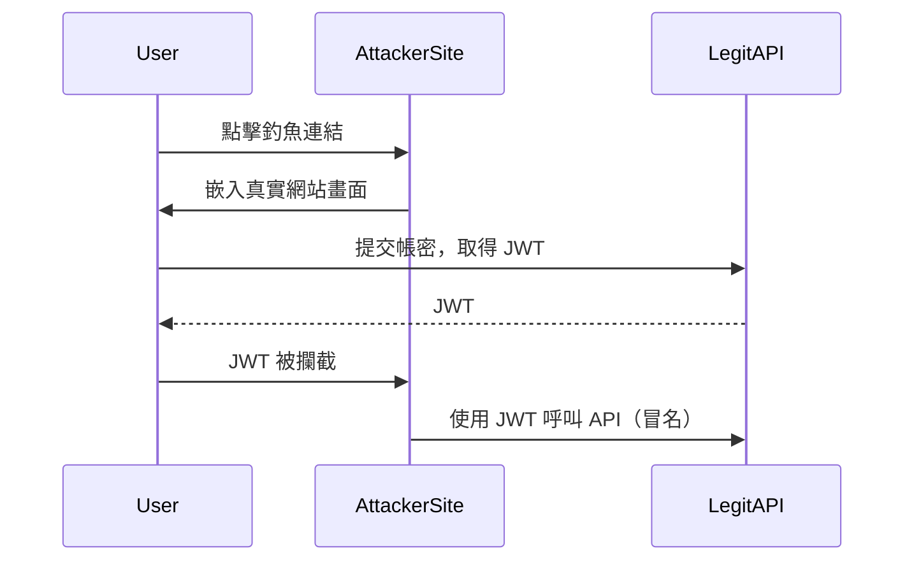
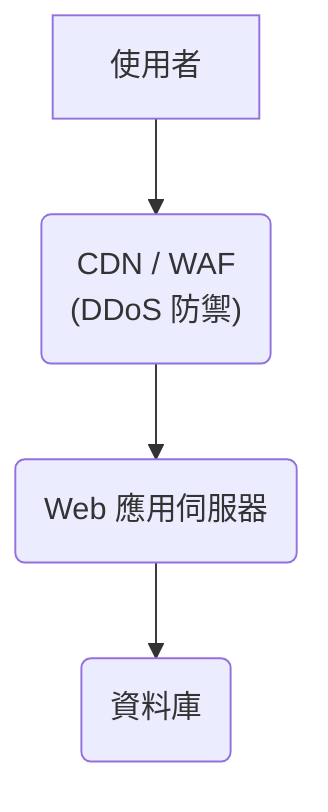
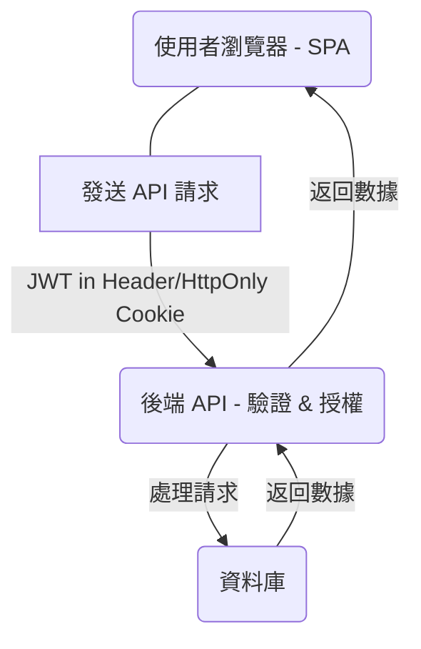

# 網站資安

## 📌 目錄
1. [JWT 被中繼攻擊（Token Forwarding）問題](#1-jwt-被中繼攻擊token-forwarding問題)
2. [OAuth2 認證流程與安全設計](#2-oauth2-認證流程與安全設計)
3. [DDoS 攻擊防禦：CDN 與 WAF](#3-ddos-攻擊防禦cdn-與-waf)
4. [HTML Encoding 防範 XSS](#4-html-encoding-防範-xss)
5. [SPA 前後端分離架構的資安考量](#5-spa-前後端分離架構的資安考量)
6. [Cache污染攻擊](#6-cache污染攻擊)
7. [如何避免快取使用者輸入](#7-如何避免快取使用者輸入)

---

## 1. JWT 被中繼攻擊（Token Forwarding）問題

### 問題說明

即使 JWT 具有短效期限與一次性驗證設計，只要使用者在真實網站登入並取得 token，該 token 被「中繼轉送（forward）」給假網站後仍可能被濫用。

### 攻擊流程圖（中繼攻擊）


## 2. OAuth2 認證流程與安全設計

OAuth2 是一種授權框架，旨在讓第三方應用程式能夠安全地存取使用者在服務提供者上的資源，而無需直接暴露使用者密碼。

四種常見授權模式
| 模式名稱                 | 適用情境                           | 特點                                                         |
| :----------------------- | :--------------------------------- | :----------------------------------------------------------- |
| **Authorization Code** | 一般 Web 應用程式 (後端)           | **安全性高**，需要跳轉並使用授權碼交換令牌。                 |
| **Implicit Flow** | 單頁應用程式 (SPA) 前端應用        | **已不建議使用**，令牌容易在 URL 片段中暴露，安全性較差。    |
| **Resource Owner Password** | 自有服務、高度信任的應用程式       | 使用者直接向客戶端提供帳號密碼，由客戶端向認證伺服器交換令牌。**應極力避免在第三方應用程式中使用。** |
| **Client Credentials** | 機器與伺服器之間的溝通 (B2B 服務) | 無使用者參與，適用於伺服器間的 API 呼叫，例如微服務間的認證。 |

## 3. DDoS 攻擊防禦：CDN 與 WAF

DDoS (Distributed Denial of Service) 攻擊是利用大量來自多個來源的惡意流量來癱瘓目標服務，使其無法正常提供服務給合法使用者。

### 常見攻擊類型

Volumetric Attacks (流量型攻擊)：旨在透過巨大流量耗盡目標的頻寬，例如 UDP Flood、DNS Amplification。

Protocol Attacks (協定型攻擊)：利用網路協定弱點來耗盡伺服器資源，例如 SYN Flood、Ping of Death。

Application Layer Attacks (應用層攻擊)：針對特定應用程式層的弱點，發送看似合法的請求，消耗應用程式資源，例如 HTTP Flood、Slowloris。

### 防禦方式比較

|防禦方式|層級	|	適合攔截的攻擊類型|
| :----------------------- | :--------------------------------- | :----------------------------------------------------------- |
| **CDN (Content Delivery Network)<br>(例：Cloudflare, GCP Cloud CDN)**|L3/L4|大量流量型攻擊 (Volumetric)<br>DNS 放大攻擊 (DNS Amplification)|
| **WAF (Web Application Firewall)<br>(例：GCP Cloud Armor, Azure WAF)**|L7|應用層攻擊 (HTTP Flood)<br>OWASP Top 10 攻擊 (如 XSS, SQLi, CSRF)|

### DDoS 防禦架構圖



## 4. HTML Encoding 防範 XSS

**跨站腳本攻擊 (XSS - Cross-Site Scripting)** 是一種常見的 Web 安全漏洞，攻擊者將惡意腳本注入網頁，當其他使用者瀏覽該網頁時，惡意腳本就會在他們的瀏覽器上執行，可能竊取敏感資訊或執行惡意操作。

### 防禦機制：HTML Encoding

**HTML Encoding** (或稱為 **HTML Escaping**) 是防範 XSS 最基本且有效的方法。它將使用者輸入中的特殊字元（如 `<`, `>`, `"`, `'`, `&` 等）轉換為其 HTML 實體 (HTML Entities)，使其在瀏覽器中顯示為普通文字而非可執行的 HTML 標籤或 JavaScript 程式碼。

### 範例：

* 惡意輸入：`<script>alert('XSS');</script>`
* HTML Encoding 後：`&lt;script&gt;alert(&#x27;XSS&#x27;);&lt;/script&gt;`

當瀏覽器解析 `&lt;script&gt;` 時，它會將其視為純文字 `<script>` 而不是一個可執行的 HTML 標籤，從而避免了腳本的執行。

### 實作建議

* **預設執行 Encoding**： 對所有來自使用者、資料庫或任何外部來源的輸入，在將其輸出到 HTML 頁面之前，都應預設進行 **HTML Encoding**。
* **使用框架內建功能**： 大多數現代 Web 框架（如 React, Angular, Vue, Laravel, Django 等）都內建了自動 HTML Encoding 或模板引擎的自動轉義功能，請確保這些功能已啟用並正確使用。
* **內容安全政策 (CSP)**： 結合 **Content Security Policy (CSP)** 可以進一步限制瀏覽器載入和執行惡意腳本的來源，作為縱深防禦的手段。

## 5. SPA 前後端分離架構的資安考量

**單頁應用程式 (SPA - Single Page Application)** 與傳統多頁應用程式相比，由於前後端職責分離，在資安設計上有其獨特的考量點。

### 主要安全挑戰與防禦策略

1.  **認證與授權 (Authentication & Authorization):**
    * **挑戰**： SPA 通常不依賴傳統的 Session/Cookie 機制來維持登入狀態。**Token-based 認證** (如 JWT) 是主流，但 Token 的儲存與傳輸安全是關鍵。
    * **防禦**：
        * **JWT 儲存**： 避免將 **JWT** 直接儲存在 `localStorage` 或 `sessionStorage` 中，因為它們容易受到 **XSS** 攻擊。建議使用 **HttpOnly Cookie** 來儲存 **Refresh Token** (用於換取新的 Access Token)，並將短效期的 **Access Token** 儲存在記憶體中。
        * **CORS 配置**： 後端 API 必須正確配置 **CORS (Cross-Origin Resource Sharing)**，只允許來自授權前端域名的請求。
        * **嚴格的 Access Token 驗證**： 後端 API 應對每個傳入的 **Access Token** 進行嚴格驗證，包括簽名、過期時間、發行者等。

2.  **API 安全：**
    * **挑戰**： SPA 完全依賴後端 API 提供數據和服務，API 成為主要攻擊目標。
    * **防禦**：
        * **參數驗證 (Input Validation)**： 前後端都需要對所有輸入進行嚴格的驗證和消毒，防止 **SQL Injection**、**NoSQL Injection** 等。
        * **限流 (Rate Limiting)**： 限制來自單一 IP 或使用者的 API 請求頻率，防止暴力破解、DDoS 攻擊。
        * **HTTPS 強制**： 所有前後端通訊都必須使用 **HTTPS**，加密傳輸內容，防止中間人攻擊。

3.  **XSS (Cross-Site Scripting) 防禦：**
    * **挑戰**： SPA 大量使用 JavaScript 和動態內容渲染，若處理不當，容易引入 **XSS** 漏洞。
    * **防禦**：
        * **數據綁定與模板引擎**： 優先使用框架提供的安全數據綁定機制和自動轉義的模板引擎。
        * **內容安全政策 (CSP)**： 設置嚴格的 **CSP** 來限制可執行腳本的來源，減少 **XSS** 風險。
        * **避免使用 `innerHTML` 或 `eval()`**： 除非絕對必要並對內容進行嚴格消毒，否則應避免使用這些可能執行任意代碼的方法。

4.  **CSRF (Cross-Site Request Forgery) 防禦：**
    * **挑戰**： 由於 **SPA** 通常使用基於 **Token** 的認證，**CSRF** 攻擊的傳統防禦機制（如 **CSRF Token** 檢查）需要重新考慮。
    * **防禦**：
        * **SameSite Cookies**： 設置 Cookie 的 `SameSite` 屬性為 `Lax` 或 `Strict`，可以有效防止跨站請求攜帶 Cookie。
        * **Origin Header 檢查**： 後端檢查請求的 `Origin` 或 `Referer` 頭部，確保請求來源合法。
        * **雙重提交 Cookie (Double Submit Cookie)** 或 **CSRF Token (如果仍使用 Session Cookie)**：對於特定情況，仍可考慮這些機制。

### 架構圖 (簡化版)


## 6. Cache污染攻擊

**快取污染攻擊 (Cache Poisoning)** 是一種網路攻擊手法，駭客會透過精心構造的第一個請求，向網站的快取伺服器（如 CDN 或反向代理）注入惡意內容。這會導致後續的合法使用者在不知情的情況下，從快取中取用到這些受污染的內容，進而引發資安問題。

### 攻擊目的與潛在危害

快取污染攻擊一旦成功，可能導致以下嚴重後果：

* **XSS 攻擊 (Cross-Site Scripting)**：惡意腳本被注入到快取內容中，當使用者瀏覽時，腳本會在他們的瀏覽器上執行，可能竊取 Cookie、劫持 Session 或進行釣魚。
* **Session 竊取 (Session Hijacking)**：攻擊者可能利用被污染的快取，讓使用者載入包含惡意程式碼的頁面，這些程式碼會嘗試竊取使用者的 Session Token，從而劫持其登入狀態。
* **資料外洩 (Data Exfiltration)**：惡意內容可能導向惡意網站、收集使用者資訊，或利用受害者的權限執行敏感操作。

### 常見污染方式

駭客通常利用以下方式來嘗試污染快取：

1.  **修改 Host Header (主機頭)**：
    攻擊者透過修改 HTTP 請求中的 `Host` 標頭，使其指向攻擊者控制的網域，但實際請求的內容路徑是目標網站的。如果快取伺服器沒有正確驗證 `Host` 標頭，就可能將惡意內容與錯誤的 `Host` 關聯起來並快取。
    
    HTTP/1.1 Normal 
    ```http    
    GET /api/data HTTP/1.1
    Host: yourdomain.com
    User-Agent: Mozilla/5.0 (Windows NT 10.0; Win64; x64) AppleWebKit/537.36 (KHTML, like Gecko) Chrome/123.0.0.0 Safari/537.36
    Accept: application/json, text/plain, */*
    Accept-Encoding: gzip, deflate, br
    Accept-Language: en-US,en;q=0.9
    Connection: keep-alive
    Cookie: session_id=abc123def456;
    ```
    HTTP/1.1 Hacker-Modified
    ```http    
    GET /api/data HTTP/1.1
    Host: attacker.com    # <-- 駭客竄改點：Host Header 被修改
    User-Agent: Mozilla/5.0 (Windows NT 10.0; Win64; x64) AppleWebKit/537.36 (KHTML, like Gecko) Chrome/123.0.0.0 Safari/537.36
    Accept: application/json, text/plain, */*
    Accept-Encoding: gzip, deflate, br
    Accept-Language: en-US,en;q=0.9
    Connection: keep-alive
    Cookie: session_id=abc123def456;
    ```
    HTTP/3 Normal
    ```http
    :method: GET
    :scheme: https
    :authority: yourdomain.com    # 正常請求的 Authority
    :path: /api/data
    user-agent: Mozilla/5.0 (Windows NT 10.0; Win64; x64) AppleWebKit/537.36 (KHTML, like Gecko) Chrome/123.0.0.0 Safari/537.36
    accept: application/json, text/plain, */*
    accept-encoding: gzip, deflate, br
    accept-language: en-US,en;q=0.9
    cookie: session_id=abc123def456;
    ```
    HTTP/3 Hacker-Modified
    ```http
    :method: GET
    :scheme: https
    :authority: attacker.com    # <-- 駭客竄改點：:authority 被修改
    :path: /api/data
    user-agent: Mozilla/5.0 (Windows NT 10.0; Win64; x64) AppleWebKit/537.36 (KHTML, like Gecko) Chrome/123.0.0.0 Safari/537.36
    accept: application/json, text/plain, */*
    accept-encoding: gzip, deflate, br
    accept-language: en-US,en;q=0.9
    cookie: session_id=abc123def456;
    ```
2.  **注入查詢參數或 Cookie**：
    攻擊者在 URL 的查詢參數或 Cookie 中注入惡意內容或特殊字元，試圖讓快取伺服器錯誤地識別為不同的內容，進而快取惡意版本。如果快取鍵 (Cache Key) 沒有正確排除這些可變參數，就可能被污染。

    ```http
    GET /?q=<script>alert(1)</script> HTTP/1.1  # 查詢參數注入
    ```

3.  **混淆編碼或特殊字元**：
    攻擊者可能利用不同的 URL 編碼方式或特殊字元，繞過快取伺服器的快取鍵檢查邏輯，使其將惡意請求與合法請求視為相同的資源並進行快取。

###  防止快取污染的作法

為有效防禦快取污染攻擊，您應採取以下關鍵措施：

1.  **避免快取動態內容 (Prevent Caching Dynamic Content)**：
    對於包含表單輸入、使用者專屬資訊或任何敏感數據的頁面，絕對不應該被快取。這可以通過在 HTTP 響應頭中設置 `Cache-Control` 指令來實現。

    ```http
    Cache-Control: no-store, no-cache, must-revalidate, max-age=0
    ```
    * `no-store`：指示任何快取機制都不得儲存響應的任何部分。
    * `no-cache`：指示快取在使用緩存副本之前必須先向源伺服器進行驗證。

2.  **明確設定快取鍵 (Define Cache Key Explicitly with Vary Header)**：
    快取鍵是快取伺服器用來識別和儲存不同內容的唯一標識。通過設定 `Vary` HTTP 響應頭，您可以告訴快取伺服器，在決定是否使用快取副本時，還需要考慮哪些請求頭的變化。

    ```http
    Vary: Accept-Encoding, Cookie, User-Agent, Authorization
    ```
    * `Vary: Accept-Encoding`：確保快取針對不同的壓縮方式（如 gzip 或 br）儲存獨立的內容。
    * `Vary: Cookie`：如果內容會因使用者的 Cookie 而異（例如登入狀態），則必須包含此項，以避免將一個使用者的敏感內容快取給其他使用者。
    * `Vary: User-Agent`：如果內容會根據不同的瀏覽器或設備而異（如響應式網頁），則應包含此項。
    * `Vary: Authorization`：如果內容受身份驗證影響，則應包含此項。

3.  **清洗 Host Header，避免反射型攻擊 (Sanitize Host Header)**：
    在您的 Web 伺服器或應用程式層，應該嚴格驗證所有傳入請求的 `Host` 標頭。只允許您的應用程式預期的合法域名，並拒絕或重定向所有其他請求。這可以有效防止基於 `Host` 標頭的快取污染。

    ```javascript
    // 以 Node.js Express 框架為例
    app.use((req, res, next) => {
        const allowedHosts = ['yourdomain.com', '[www.yourdomain.com](https://www.yourdomain.com)'];
        if (!allowedHosts.includes(req.hostname)) {
            // 可以選擇返回 400 Bad Request 或重定向到正確的域名
            return res.status(400).send('Invalid Host Header');
            // 或者 res.redirect('[https://yourdomain.com](https://yourdomain.com)' + req.originalUrl);
        }
        next();
    });
    ```


## 7. 如何避免快取使用者輸入

快取使用者輸入通常是指瀏覽器或 Web 伺服器將使用者在表單中輸入的敏感資訊（如密碼、信用卡號等）儲存起來，這可能導致資安風險。

### 主要風險

* **敏感資訊洩露**：如果裝置被盜或被未經授權的人員使用，快取的敏感資訊可能被存取。
* **Session 劫持**：如果會話 ID 或其他敏感 Token 被快取在可被外部存取的資源中，可能導致 Session 劫持。
* **不安全的瀏覽器行為**：瀏覽器的自動填充功能雖然方便，但也可能在不安全的環境下洩露資訊。

### 防禦策略

1.  **使用 `autocomplete="off"` 屬性**：
    在 HTML 表單的敏感輸入欄位上，設定 `autocomplete="off"` 屬性，指示瀏覽器不要自動完成或記住這些欄位的值。

    ```html
    <input type="password" name="password" autocomplete="off">
    <input type="text" name="credit_card_number" autocomplete="off">
    ```
    **注意**：雖然這是標準做法，但現代瀏覽器可能會出於使用者體驗考量而忽略此屬性。因此，它不能作為唯一的防禦手段。

2.  **避免在 URL 中傳遞敏感數據**：
    絕對不要將敏感資訊（如 **Token**、**Session ID**、密碼等）作為 URL 參數（查詢字串）傳遞。這些資訊會被記錄在瀏覽器歷史、伺服器日誌，並可能被中間人攻擊者截獲。應始終使用 **POST 請求體** 並結合 **HTTPS** 進行傳輸。

3.  **使用適當的 HTTP Cache-Control Header**：
    針對包含敏感資訊的頁面或 API 回應，應設定適當的 HTTP 快取控制標頭，指示瀏覽器和中間代理不要快取內容。

    ```
    Cache-Control: no-store, no-cache, must-revalidate, proxy-revalidate
    Pragma: no-cache
    Expires: 0
    ```
    * `no-store`：指示快取不要儲存任何內容。
    * `no-cache`：指示快取在每次使用前重新驗證（而非不儲存）。
    * `must-revalidate`：強制快取在每次使用前重新驗證。
    * `Expires: 0` 和 `Pragma: no-cache`：用於向下相容舊版 HTTP/1.0。

4.  **敏感數據只在記憶體中處理**：
    在前端 JavaScript 中處理敏感數據時，盡量只在函數作用域內將其儲存在記憶體中，並在不再需要時立即清除變數，避免將其持久化儲存在 `localStorage` 或 `sessionStorage` 中。

5.  **定期清理會話數據**：
    確保在使用者登出後，所有與會話相關的敏感數據（包括 **Token**、**Session ID** 等）都從瀏覽器存儲中清除。

### 總結

防範快取使用者輸入需要多層次的防禦策略，結合 **HTML 屬性**、**HTTP Headers** 和安全的程式碼實踐，以最大程度降低敏感資訊洩露的風險。